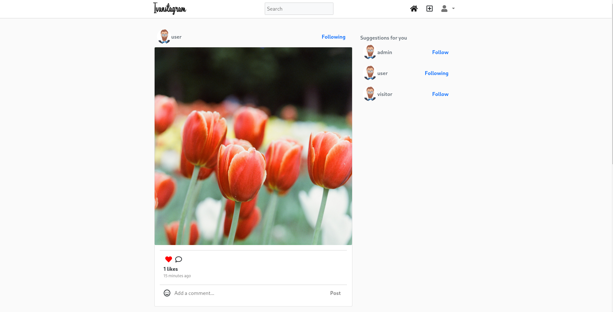

Ivanstagram is a mini [Instagram](www.instagram.com) clone for the sake of practice. It need improvement but ok already.

You can visit it on https://ivanstagram.herokuapp.com/. Be patient on initial load! It's a free dyno and it takes some time.

Some of the technologies include:

[JHipster](https://www.jhipster.tech/) with:

- [Spring](https://spring.io/)
- [PostgreSQL](https://www.postgresql.org/)
- [Typescript](https://www.typescriptlang.org/)
- [React](https://reactjs.org/)
- [Use Hooks ts](https://usehooks-ts.com/)
- [Hibernate](https://hibernate.org/)
- [Liquibase](https://www.liquibase.org/)
- [SASS](https://sass-lang.com/)
- [Reactstrap](https://reactstrap.github.io)
- [FontAwesome](https://fontawesome.com/)

 
 

